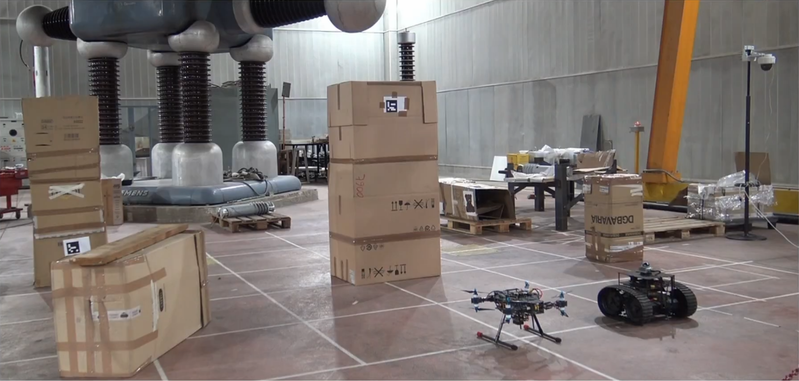

# H-CoRE Hardware Deployment Tutorial

This tutorial provides comprehensive instructions for deploying the H-CoRE (Heterogeneous Cooperative multi-Robot Execution) framework on real hardware platforms. The system enables deployment of heterogeneous robotic agents including UAVs (Unmanned Aerial Vehicles), UGVs (Unmanned Ground Vehicles) and PTZ (Pan-Tilt-Zoom Camera) in both single-agent and cooperative multi-agent configurations.

*Figure 1: H-CoRE Framework hardware deployment showing real UAV and UGV agents in operational environment*

## Table of Contents

1. [Hardware Architecture Overview](#hardware-architecture-overview)
2. [System Requirements](#system-requirements)
3. [Installation and Setup](#installation-and-setup)
4. [Single Agent Hardware Deployment](#single-agent-hardware-deployment)
5. [Multi-Robot Hardware Coordination](#multi-robot-hardware-coordination)
6. [Ground Control Station Setup](#ground-control-station-setup)

## Hardware Architecture Overview

The H-CoRE framework hardware deployment implements a distributed architecture where each agent operates as an autonomous unit with onboard computation while maintaining communication through a centralized Ground Control Station (GCS).

### System Components

- **UAV Agent**: PX4-based tilting octacopter with onboard companion computer running ROS2 Humble
- **UGV Agent**: Ground robot platform with onboard companion computer running ROS2
- **Ground Control Station (GCS)**: Centralized mission management and monitoring system
- **PTZ Camera Agent**: Pan-tilt-zoom camera system for surveillance and inspection tasks

## System Requirements

### UAV Hardware Platform
- **Flight Controller**: PX4-compatible autopilot (Pixhawk 6C/6X recommended)
- **Companion Computer**: NVIDIA Jetson Orin NX 16 GB
- **Sensors**: RGB-D camera, IMU, GPS with RTK capability
- **Communication**: WiFi 6 module with directional antenna
- **Power System**: Li-Po battery 

### UGV Hardware Platform  
- **Base Platform**: Differential drive or Ackermann steering robot chassis
- **Computing Unit**: Intel NUC with Intel i7 processor
- **Navigation Sensors**: 3D LiDAR, RGB-D camera, wheel encoders, IMU
- **Communication**: WiFi 6 adapter with omnidirectional antenna
- **Power System**: Li-Po battery 

## Support and Maintenance

For technical support, hardware-specific issues, or deployment assistance:

- **H-CoRE Framework Issues**: [H-CoRE Repository Issues](https://github.com/Prisma-Drone-Team/H-CoRE/issues)
- **UAV Hardware Issues**: [UAV Motion Stack Issues](https://github.com/Prisma-Drone-Team/uav_motion_stack/issues)  
- **UGV Hardware Issues**: [Rover Navigation Issues](https://github.com/Prisma-Drone-Team/Rover-Navigation/issues)
- **PTZ Camera Issues**: [PTZ Docker SW Issues](https://github.com/Prisma-Drone-Team/ptz_docker_sw/issues)

For comprehensive hardware deployment documentation and platform-specific guides, refer to the individual repository README files and the H-CoRE framework research publication.