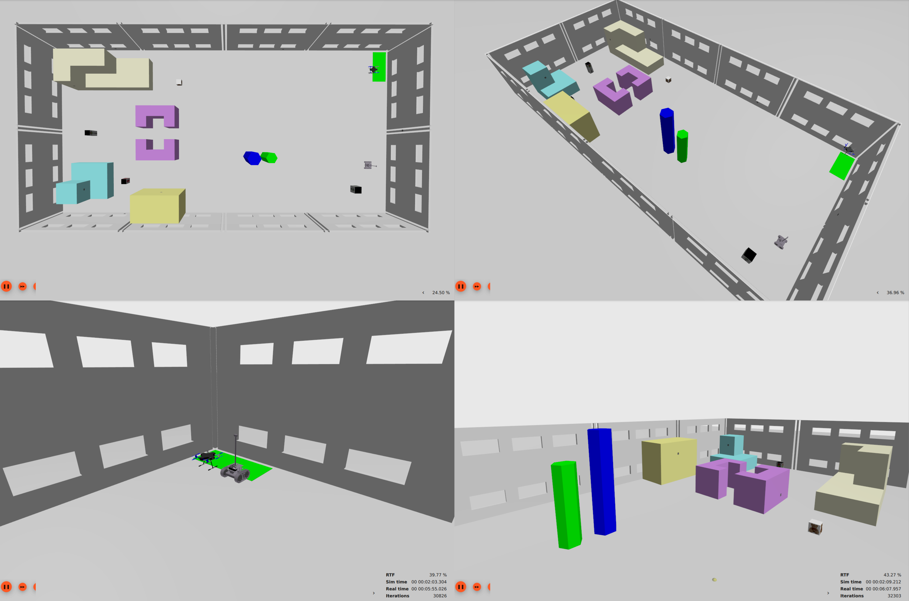

# H-CoRE Simulation Setup Tutorial

This tutorial provides comprehensive instructions for setting up and running the H-CoRE (Heterogeneous Cooperative multi-Robot Execution) framework simulation environment. The system enables simulation of heterogeneous robotic agents including UAVs (Unmanned Aerial Vehicles), UGVs (Unmanned Ground Vehicles) and PTZ (Pan-Tilt-Zoom Camera) in both single-agent and multi-agent configurations.



*Figure 1: H-CoRE Framework simulation showing cooperative UAV and UGV agents in Gazebo Garden environment*

## Table of Contents

1. [Architecture Overview](#architecture-overview)
2. [System Requirements](#system-requirements)
3. [Installation and Setup](#installation-and-setup)
4. [Single Agent Simulation](#single-agent-simulation)
5. [Multi-Robot Simulation](#multi-robot-simulation)
6. [Visualization with RViz](#visualization-with-rviz)
7. [Troubleshooting](#troubleshooting)
8. [Advanced Configuration](#advanced-configuration)

## Architecture Overview

The H-CoRE framework implements a modular architecture with dockerized environments for each agent type, enabling seamless integration and isolated development:

### System Components

- **UAV Agent**: PX4 SITL-based drone simulation with autonomous navigation
- **UGV Agent**: Ground robot with advanced navigation and exploration capabilities  
- **Ground Control Station (GCS)**: Mission management and monitoring interface
- **PTZ Camera Agent**: Pan-tilt-zoom camera system for surveillance tasks

### Software Stack

- **ROS2 Humble**: Primary robotics framework
- **Gazebo Garden**: 3D physics simulation environment
- **PX4 v1.14+**: Autopilot firmware for UAV control
- **Navigation2**: Advanced navigation stack for UGV operations
- **Docker**: Containerized deployment environments

### Communication Architecture

All agents communicate through the ROS2 DDS middleware using domain ID 17 for simulation environments. The system utilizes headless simulation for optimal real-time performance, with RViz providing comprehensive visualization capabilities.

## System Requirements

### Hardware Requirements
- **CPU**: Intel i5-8th generation or equivalent AMD processor
- **RAM**: Minimum 8 GB, recommended 16 GB
- **GPU**: NVIDIA GPU with CUDA support (optional but recommended)
- **Storage**: 20 GB free disk space

### Software Dependencies
- **Ubuntu 22.04 LTS** (Jammy Jellyfish)
- **Docker Engine** (version 20.10+)
- **Docker Compose** (version 2.0+)
- **Git** with LFS support
- **X11** forwarding capability for visualization

## Installation and Setup

### 1. Repository Preparation

Clone the H-CoRE simulation repositories to your development workspace:

```bash
# Create main development directory
mkdir -p ~/docker_dev && cd ~/docker_dev

# Clone H-CoRE main repository
git clone https://github.com/Prisma-Drone-Team/H-CoRE.git

# Clone UAV motion stack with SITL utilities
git clone --recursive https://github.com/Prisma-Drone-Team/uav_motion_stack.git -b paper_stable sitl_utils

# Clone UGV simulation stack
git clone https://github.com/Prisma-Drone-Team/rover_sim_motion_stack.git
```

### 2. UAV Simulation Environment Setup

Navigate to the UAV simulation directory and configure the environment:

```bash
cd ~/docker_dev/sitl_utils

# Clone PX4 Neabotics custom firmware (required for plug-and-play functionality)
git clone --single-branch -b feature/diffgains_fix_servo_k \
    https://github.com/Prisma-Drone-Team/Px4_hcore_autopilot.git PX4_neabotics --recursive

# Build UAV Docker image
cd docker
docker build -t leo-img -f px4_humble_dockerfile.txt .
```

### 3. UGV Simulation Environment Setup

Configure the ground vehicle simulation stack:

```bash
cd ~/docker_dev/rover_sim_motion_stack

# Select appropriate branch based on simulation requirements
# For standalone UGV simulation:
git checkout leonardo

# For multi-robot simulation:
git checkout multi-robot

# Build UGV Docker image
./docker_build.sh rover_sim_image
```

### 4. Environment Configuration

Enable X11 forwarding for GUI applications:

```bash
# Allow Docker containers to access X11 display
xhost +local:docker

# Configure display variable (if needed)
export DISPLAY=:0
```

## Single Agent Simulation

### UAV (Drone) Single Agent Simulation

The UAV simulation provides a complete PX4 SITL environment with autonomous navigation capabilities.

#### Starting the UAV Simulation

```bash
cd ~/docker_dev/sitl_utils

# Launch UAV simulation container
./run_cnt.sh
```

Within the container, the simulation environment is automatically configured. To start the simulation:

```bash
# Start the UAV simulation using TMUX session management
tmuxp load src/pkg/babyk_drone_manager/utils/simulation.yml
```

#### UAV Simulation Components

The TMUX session launches multiple components:

- **PX4 SITL**: Core autopilot simulation with Gazebo Garden integration
- **RViz**: 3D visualization interface with pre-configured drone perspective
- **ArUco Detector**: Computer vision node for marker-based localization  
- **MicroXRCE Agent**: Communication bridge between PX4 and ROS2
- **ROS-Gazebo Bridge**: Sensor data and odometry relay services

#### UAV Control Interface

The drone can be controlled through multiple interfaces:

- **Joy Controller**: Gamepad-based manual control
- **Mission Planner**: Waypoint-based autonomous navigation
- **Teleoperation**: Keyboard and mouse control via dedicated ROS2 nodes

### UGV (Rover) Single Agent Simulation

The UGV simulation implements advanced autonomous navigation using the Navigation2 stack.

#### Starting the UGV Simulation

```bash
cd ~/docker_dev/rover_sim_motion_stack

# Launch UGV simulation with automatic initialization
./docker_run.sh rover_sim_image rover_container
```

#### UGV Simulation Features

The rover simulation includes:

- **Autonomous Navigation**: Advanced path planning with obstacle avoidance
- **SLAM Capabilities**: Simultaneous localization and mapping using multiple sensors
- **Object Detection**: YOLOv11-based perception system
- **Exploration Algorithms**: Coverage path planning for area exploration
- **Multi-Sensor Fusion**: LiDAR and camera data integration

#### UGV Navigation Interface

Navigate the rover using:

- **Goal Setting**: Interactive marker placement in RViz
- **Exploration Mode**: Autonomous area coverage algorithms
- **Manual Control**: Direct velocity commands via teleoperation nodes

## Multi-Robot Simulation

The multi-robot configuration enables cooperative behavior between UAV and UGV agents, demonstrating the full H-CoRE framework capabilities.

### Multi-Robot System Architecture

The multi-robot simulation establishes communication between heterogeneous agents through shared ROS2 domain configuration, enabling:

- **Collaborative Mission Planning**: Distributed task allocation between agents
- **Shared Situational Awareness**: Common world representation across all agents
- **Cooperative Navigation**: Coordinated movement planning to avoid conflicts
- **Data Fusion**: Integration of sensor data from multiple perspectives

### Starting Multi-Robot Simulation

#### Step 1: Launch Multi-Robot UAV Container

```bash
cd ~/docker_dev/sitl_utils

# Start UAV container with multi-robot configuration
./run_multi_cnt.sh
```

#### Step 2: Initialize Multi-Robot Session

Within the UAV container:

```bash
# Launch multi-robot simulation session
tmuxp load src/pkg/babyk_drone_manager/utils/multi_simulation.yml
```

#### Step 3: Verify UGV Integration

The multi-robot TMUX configuration automatically launches the UGV simulation within the shared environment. The rover workspace is mounted from the external rover_sim_motion_stack repository, ensuring seamless integration.

### Multi-Robot Coordination Features

The multi-robot simulation demonstrates:

- **Shared Gazebo World**: Both agents operate in the same physics simulation
- **Unified Coordinate System**: Common reference frame for all operations
- **Inter-Agent Communication**: ROS2 topic sharing for coordination messages
- **Distributed Perception**: Complementary sensor coverage between aerial and ground perspectives

### Mission Coordination Scenarios

Test various cooperative scenarios:

1. **Search and Rescue**: UAV provides aerial reconnaissance while UGV performs ground navigation
2. **Infrastructure Inspection**: Coordinated inspection with different viewpoints
3. **Area Mapping**: Combined aerial and ground SLAM for comprehensive mapping
4. **Target Tracking**: Cooperative target following with handoff capabilities

## Visualization with RViz

RViz provides comprehensive visualization for both single-agent and multi-robot simulations through optimized headless operation.

### RViz Configuration Features

The pre-configured RViz setup includes:

- **3D Environment Visualization**: Real-time Gazebo world representation
- **Robot State Display**: Joint states, transforms, and motion trajectories  
- **Sensor Data Overlay**: LiDAR, camera, and depth sensor visualization
- **Navigation Visualization**: Path planning, costmaps, and goal markers
- **Multi-Agent Tracking**: Simultaneous display of all active agents

### Custom RViz Perspectives

Access specialized visualization modes:

```bash
# UAV-focused perspective
ros2 run rviz2 rviz2 -d ~/ros2_ws/src/pkg/babyk_drone_manager/rviz/leo.rviz

# Navigation-focused perspective  
ros2 run rviz2 rviz2 -d ~/rover_ws/src/pkg/rover_manager/rover.rviz
```
### Performance Optimization

The headless simulation configuration ensures optimal performance:

- **GPU Acceleration**: Automatically detected CUDA support for enhanced rendering
- **Resource Management**: Efficient CPU and memory usage through containerization
- **Real-Time Constraints**: Low-latency communication for responsive control
- **Scalable Architecture**: Support for additional agents with minimal performance impact

## Conclusion

This tutorial provides a comprehensive foundation for operating the H-CoRE simulation environment in both single-agent and multi-robot configurations. The dockerized architecture ensures reproducible deployment while the headless operation with RViz visualization maintains optimal performance for complex cooperative robotics research and development.

For additional resources and advanced configuration options, refer to the individual repository documentation and the H-CoRE framework research publication.

## Support and Contributions
For technical support and bug reports:

- **H-CoRE Framework Issues**: [H-CoRE Repository Issues](https://github.com/Prisma-Drone-Team/H-CoRE/issues)
- **UAV Motion Stack Issues**: [UAV Motion Stack Issues](https://github.com/Prisma-Drone-Team/uav_motion_stack/issues)
- **UGV Simulation Stack Issues**: [Rover Sim Motion Stack Issues](https://github.com/Prisma-Drone-Team/rover_sim_motion_stack/issues)

For comprehensive documentation, refer to the H-CoRE framework research publication (currently under review).
